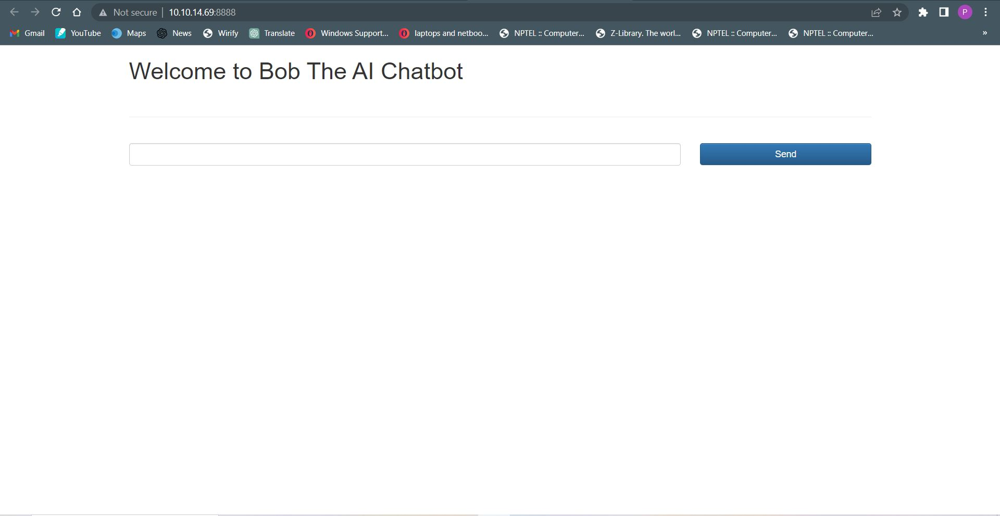
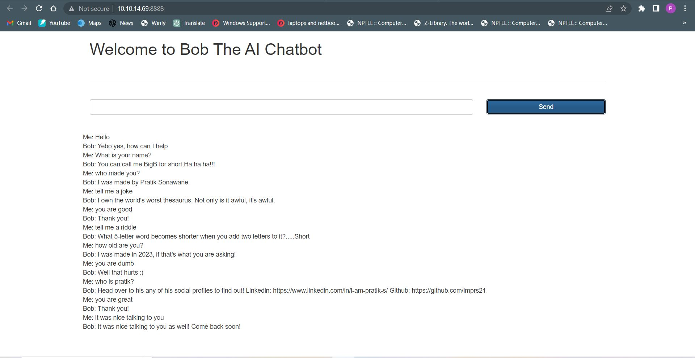

# Bob, The Deep-Learning Chatbot

## About this Project
This repository contains code for building a chatbot using Python and several libraries, including Natural Language Processing (NLP) library NLTK, deep learning library Keras, machine learning library TensorFlow, and web application framework Flask.


## Overview
This chatbot is designed to simulate conversation with human users, using NLP techniques to understand user input and generate appropriate responses. It is built using a combination of rule-based and machine learning approaches, and is trained on a dataset of conversational data.
## Project UI
Home Page:



Bot in action:



## Requirements
- Python 3.6 or higher
- NLTK
- Keras
- TensorFlow
- Flask
  

## To run it locally on your system, follow these steps:
1. Clone this repository onto your system. On Command Prompt, run the following command:
```
git clone https://github.com/imprs21/ChatBot.git
```

2. Install all the required libraries 
```
pip install nltk
pip install numpy
pip install keras
pip install tensorflow
pip install flask
```

3. Run the chatbot.py file to create the model
```
python chatbot.py
```

4. Run the APP to create a Flask front end on port 8888 (or any port the app is pointing to)
```
python app.py
```
Now you can use the chatbot!!!

